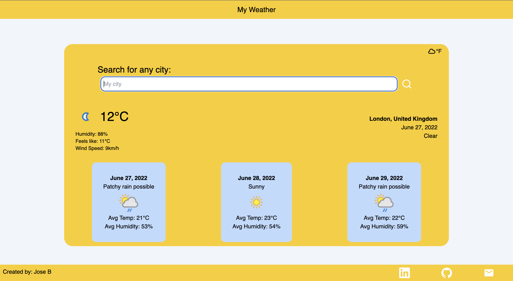

# My Weather
The point for this project was to build a weather app using typeScript and fetching a REST API. This project 
helped me learn the true strength of typeScript and got me more familiar with REST APIs. My Weather is pretty simple to use, all you have to do is search for a city and it will fetch the current weather along with a three day forecast. The technologies I used were typeScript, React, NextJs, TailWindCSS, and [Weather API](https://www.weatherapi.com/). 

## My Weather

## Stack for this project
* React
* Tailwind CSS
* TypeScript
* NextJs